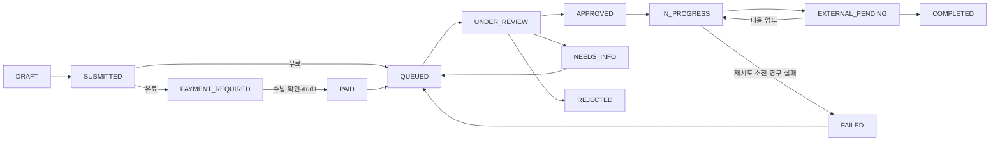

# 1차 부가서비스 구현 보고서

최신 원격 main `b16a52b` 기준. Rust/Axum/SQLx modular monolith를 확장했다. REST와 기존 `/api/orgs/{org}` 규약을 유지한다. 기존 인증·CSRF·Worker 프록시를 그대로 쓸 수 있어 별도 gRPC 시스템을 추가하지 않는다.

## 기존 구조 재사용

`catalog.artists/releases/tracks/assets`, `identity.memberships/resources/resource_acl`, `identity.staff_members`, `operations.jobs/outbox/event_receipts/audit_events`를 재사용한다. MV ID는 기존 VIDEO asset ID이다. track은 release ACL을 상속한다. 주문과 대상 ACL을 모두 확인한다. finance의 기존 payout_orders는 정산 지급용이며, 서비스 구매와 방향·계약이 달라 구매 엔티티로 재사용하지 않는다. PG·실제 원장 연계는 후속 작업이다.

## Migration과 관계

`0069_addon_services.sql`은 전방 migration이다. 이전 migration은 변경하지 않는다.

| 테이블 | 역할 |
|---|---|
| catalog.addon_service_catalog | 코드+버전별 가격·단위·기간·수정 한도. active 버전은 코드당 하나 |
| catalog.addon_orders | 기존 resource registry, artist/release/track/video asset 조직별 복합 FK. 주문 시 금액·통화·버전·기간·수정 한도 snapshot |
| catalog.addon_idempotency | 조직+신청자+키, 요청 hash와 order FK. 변경/삭제 금지 |
| artist_profile_requests | 주문 1:1, 요청 종류·플랫폼·메모 |
| migration_requests | 주문 1:1, 기존 배급사·원 발매일·URLs·ISRC 유지·UPC 판단·전달/매칭/테이크다운 순서 |
| lyrics_requests | 주문 1:1, 가사·LRC asset·sync 결과·Basic Video 요청 |
| lyric_video_requests | 주문 1:1, template·source/output asset·render 결과. revision_count는 공통 order가 단일 원본 |
| mv_requests | 주문 1:1, 심의 방식·증빙 asset·승인자/시간/만료일·전달 결과 |
| promo_requests | 주문 1:1, 고유 slug·pre-save/pre-order·QR/card assets |
| addon_dsp_links | 주문 1:N, 플랫폼별 HTTPS URL |
| addon_provider_tasks | 주문 1:N, generation·기존 job FK·provider·외부 참조번호·결과 |
| addon_release_priorities | 기존 release당 적용 주문 FK·priority. 취소/거절/실패 시 제거 |

주문·상세·task·idempotency에 조직 RLS를 적용한다. snapshot/target 및 catalog 버전의 가격은 DB trigger로 보호한다. 가격 변경은 ADMIN API로 새 버전을 생성한다. 기존 audit_events에 nullable before_value/after_value를 추가하고 append-only 구조를 유지한다. 기존 upload asset에 VIDEO/LRC를 추가한다.

목록은 최대 100건 keyset pagination, `(created_at,id)` cursor를 사용한다. 조직/서비스/상태/담당자/release/artist 인덱스를 둔다. SLA timestamps: submitted_at, first_reviewed_at, accepted_at, processing_at, completed_at.

## 서비스별 구현

가격의 원본은 DB catalog seed이다. Rust/클라이언트에 가격표를 복제하지 않는다.

| 코드 | 초기 가격 / 단위 | 준비된 업무 |
|---|---|---|
| PROFILE_BASIC | 0 / artist | DSP 연결·YouTube OAC·상태 확인 요청 |
| PROFILE_PLUS | 19,000 / artist | 오매칭·분리·통합·이름 변경·재요청·장기 관리, 12개월(calendar months) 유효기간 snapshot 및 활성/유효 주문 중복 방지 |
| MIGRATION | 0 / release | ISRC 유지, UPC 판단, 원 발매일, 새 전달 → 매칭 확인 → 이전 배급 테이크다운 |
| PRIORITY_DELIVERY | 10,000 / release | 기존 내부 심사/QC/배급 queue의 HIGH priority 및 모니터링 업무 |
| LYRICS_BASIC | 0 / track | 일반 가사·제공 LRC·수동 등록·Basic Video 요청 |
| AI_SYNC_LYRICS | 5,000 / track | sync/LRC 생성 업무 및 결과 asset 등록 |
| LYRIC_VIDEO_PLUS | 30,000 / track | sync+premium render, template/source/output, 포함 수정 2회 |
| PROMO_BASIC | 0 / release | slug·pre-save/pre-order·DSP links·QR/card 업무 및 결과 연결 |
| MV_REVIEW_AND_GLOBAL | 25,000 / VIDEO asset | 심의 준비 → 결과 증빙 승인 → 글로벌 전달 준비 |
| MV_GLOBAL_ONLY | 10,000 / VIDEO asset | 검증된 증빙 필수, 승인/유효기간 확인 전 진행·전달 차단 |
| MUSIC_DATA_BASIC | 0 / release | 공개 음악 DB 등록 업무와 결과 추적 |

기본 음원 배급과 Promo Plus는 추가하지 않는다. code/category와 ProviderAdapter는 확장 가능하다. 미구현 코드의 신청은 거절한다.

## API

모든 호출은 기존 service secret와 로그인 세션, 쓰기는 Origin/CSRF를 요구한다. ADMIN API는 기존 ACTIVE staff ADMIN ACL을 재확인하고 쓰기 transaction에서 역할을 잠근다. edge가 Idempotency-Key를 전달한다.

| Method | 경로 |
|---|---|
| GET | /api/addons/catalog |
| POST, GET | /api/orgs/{org}/addons/orders |
| GET | /api/orgs/{org}/addons/orders/{id} |
| POST | /api/orgs/{org}/addons/orders/{id}/cancel |
| PUT | /api/orgs/{org}/addons/orders/{id}/details |
| POST | /api/orgs/{org}/addons/orders/{id}/revisions |
| POST | /api/orgs/{org}/addons/orders/{id}/follow-ups |
| GET | /api/admin/addons/orders |
| GET | /api/admin/addons/orders/{id} |
| POST | /api/admin/addons/orders/{id}/assign |
| POST | /api/admin/addons/orders/{id}/status |
| POST | /api/admin/addons/orders/{id}/request-info |
| POST | /api/admin/addons/orders/{id}/approve |
| POST | /api/admin/addons/orders/{id}/reject |
| POST | /api/admin/addons/orders/{id}/complete |
| POST | /api/admin/addons/orders/{id}/payment |
| POST | /api/admin/addons/orders/{id}/refund |
| POST | /api/admin/addons/orders/{id}/evidence |
| POST | /api/admin/addons/orders/{id}/results |
| PUT | /api/admin/addons/catalog/{code} |

신청은 Idempotency-Key(8~128 ASCII 문자) 필수. `{service_code,target_type,target_id,details}`를 받는다. details discriminator는 artist_profile/migration/priority/lyrics/lyric_video/mv/promo/music_data. 클라이언트 가격·상태 등의 임의 필드는 deny_unknown_fields로 거절한다. 동일 키+동일 payload는 같은 주문을 반환하고 다른 payload는 409이다.

모든 변경은 `{row_version,reason}`을 요구한다. 관리자 action에 status/payment_reference/refund_reference/assigned_admin_user_id를 추가한다. 결제는 실제 수납 확인을 reference와 함께 기록하여 PAID로 이동한다. 이어서 status=QUEUED로 진행한다. 실제 환불 확인도 별도 endpoint에서 기록한다. 자동 결제 성공은 없다.

details PUT은 NEEDS_INFO 자료 보완이다. revisions POST는 Lyric Video 수정 요청이다. evidence는 `{approved,valid_until}`을 추가하며 미래 유효기간이 필수다. results는 external_reference와 해당 서비스의 검증된 lrc/output/qr/card/evidence asset ID, dsp_links, migration_step, mv_distribution_status를 받는다. Migration 단계: UPC_APPROVED/UPC_NOT_AVAILABLE → DELIVERED → MATCH_CONFIRMED → TAKEDOWN_REQUESTED → TAKEDOWN_COMPLETED. MV 전달은 PREPARED → DELIVERED만 가능하다.

필터: service_code, paid(유료 여부), status, assigned_admin_user_id, submitted_from/to, artist_id, release_id, priority, needs_info, external_pending, failed, unprocessed_hours, before_created_at/before_id, limit. 관리자 상세에 최근 200건 audit를 포함한다.

## 파일과 상태 머신

기존 POST `/api/orgs/{org}/uploads` 및 `/uploads/{session}/complete` 사용. VIDEO는 video/mp4(최대 2GiB), LRC는 UTF-8 text/plain/application/x-lrc(최대 1MiB). signed upload → quarantine → immutable copy → metadata/bytes/hash 검증 → completed session을 유지한다. MV는 ffprobe가 실제 영상 stream을 확인하고 LRC는 타임스탬프를 검증한다. 주문/결과에 직접 외부 object key를 받을 수 없다. AUDIO는 기존 QC PASS도 필요하다.

원본 상태 계약은 config/states.json의 addon_order_status이다. 기존 enum 생성기, DB allowed_transitions 및 guard를 사용한다. 모든 전이는 중앙 workflow 함수로 처리하고 수납 확인의 PAID 전이도 같은 모듈에 모은다.

취소는 완료/거절 후에는 불가능하다. 완료 주문 재개는 LYRIC_VIDEO_PLUS 수정 및 유효기간 내 PROFILE_PLUS follow-up만 허용한다. PROFILE_PLUS는 재결제 없이 기존 주문에 재요청을 기록하고 관리자 재검토로 이동한다. 1~2회는 새 render generation, 초과는 UNDER_REVIEW에서 관리자 판단을 기다린다. 추가 edge는 상태 contract에 있다. 무료 amount=0/NOT_REQUIRED, 유료 PENDING→PAID, 실제 환불 기록 시 REFUNDED이다. 최초 snapshot은 변경할 수 없다.

## Queue/outbox/audit

상태 write+audit+outbox+outbox.record enqueue를 한 transaction으로 묶는다. addon.dispatch 소비 시 기존 receipt와 실제 job enqueue도 한 transaction이다. `(event,kind)` dedupe 및 generation으로 replay/수정 전 stale 작업을 차단한다. 작업 전 활성 신청자·membership·target ACL·대상/파일·결제·MV 증빙을 재검사하며 commit 시 lease/token fence를 확인한다. 일시적 실패는 backoff로 재시도하고 영구/소진 실패만 DLQ 및 FAILED로 표시한다.

Job: addon.profile.process, addon.migration.prepare, addon.priority.apply, addon.lyrics.sync, addon.lyric_video.render, addon.promo.smartlink, addon.promo.card, addon.mv.review_prepare, addon.mv.distribute, addon.music_data.submit. MV 전달은 기존 delivery, 나머지는 interactive queue에 연결한다.

Priority는 기존 QC/rights/distribution/delivery 대기 작업과 미래 작업에 HIGH=10을 적용한다. 실행 중 작업은 변경하지 않는다. 취소/거절/실패 시 대기 작업의 이전 priority를 복원한다. NORMAL=0/HIGH=10/URGENT=20을 저장할 수 있다. claim은 기존 priority에 5분마다 대기 가산점 1점을 추가하여 오래 기다린 일반 작업도 선택한다. 내부 처리 우선권이며 DSP 공개시간을 약속하지 않는다. 기존 권리/계약/승인/freshness gate를 변경하지 않는다.

Audit는 신청·가격 snapshot·수납/환불·배정·상태·보완·증빙·수정 횟수·override·priority·외부 업무/결과를 actor/time/reason/before/after로 남긴다. job retry/DLQ/claim/success는 기존 audit 체계를 사용한다.

## Manual 외부 연동, TODO 및 운영 credential

ManualAdapter는 외부 task만 만들고 EXTERNAL_PENDING으로 유지한다. 실제 파트너 전달·렌더링·공개 DB 등록을 완료했다고 가정하지 않는다. 관리자가 외부 참조번호/검증된 결과를 등록해야 완료된다.

| 준비된 route | 실제 운영 전 필요한 연결 |
|---|---|
| dsp-profile-manual | DSP별 프로필 처리 권한 및 YouTube OAC 지원 파트너 자격/승인 경로 |
| musixmatch-manual | Musixmatch 등 가사 등록 계약/credential, AI sync 엔진 및 권리/데이터 처리 정책 |
| audeniq-manual (영상) | 렌더러, 적법한 template/font, 품질 사양 및 수정 운영 기준 |
| audeniq-manual (홍보) | Smart Link 공개 도메인/페이지, pre-save OAuth·DSP 권한, pre-order 정책, QR/card 생성기 |
| review-agency-manual | 심의기관/방송국 신청 자격·실제 처리 경로·증빙 유효성 기준 및 제공되는 credential |
| video-dsp-manual | 영상 송출 계약·실제 영상/메타데이터 spec·전달 및 응답 credential |
| listenbrainz-manual | 지원 DB별 등록/수정 권한, 필요시 token, attribution/이용조건 |
| migration manual | 이전 배급사 테이크다운 권한/확인 경로 및 매칭 판단 기준 |
| payment/refund manual | PG 가맹 계약, merchant credential, webhook 서명키, 대사·환불·기존 finance 연계 |

후속 adapter는 WorkItem의 안정적인 idempotency key를 외부 provider에도 적용해야 한다. receipt와 reconciliation을 구현하고 결과 파일도 기존 검증 경로로 등록한다. 사용자 URL을 서버가 직접 fetch하지 않는다. 실제 운영 전 partner adapter/timeout/rate limit, signed PG webhook, public link/OAuth/render, DLQ/SLA 모니터링, 가격·유효기간 정책, migration+runtime grants 적용 및 대형 영상 임시 디스크/동시성 설정이 필요하다.

## 파일과 검증

추가: crates/core/src/addons/{mod,model,workflow,api,jobs}.rs, crates/core/tests/addons.rs, migrations/0069_addon_services.sql, docs/ADDON_SERVICES.md, docs/ADDON_VALIDATION.md.

수정: config/states.json, crates/core/src/{api,domain,error,lib,operations,uploads}.rs, crates/edge/src/lib.rs, deploy/grants.sql, docs/API.md, crates/core/tests/stage2.rs(기존 fixture의 UPC 수정 시 row_version 증가).

무료/유료/결제/잘못된 전이/ACL/가격 snapshot/동시 idempotency/PROFILE_PLUS 중복/MV 증빙 및 만료/수정 2회/기존·미래 priority/aging/취소 후 작업/outbox replay/audit/환불/retry·DLQ/이전 순서/전체 서비스/manual 결과/실제 LRC·MV 업로드/런타임 RLS를 테스트한다. 최종 검증 결과는 ADDON_VALIDATION.md에 기록한다.

기존 release pipeline 상태, frozen revision/package, 권리·계약·DSP 승인 로직은 변경하지 않는다. 영향은 resource kind 및 upload 종류 확장, nullable audit 열, addon outbox/worker 분기, 기존 queue priority/aging이다. release/distribution 회귀 suite를 함께 실행한다.
