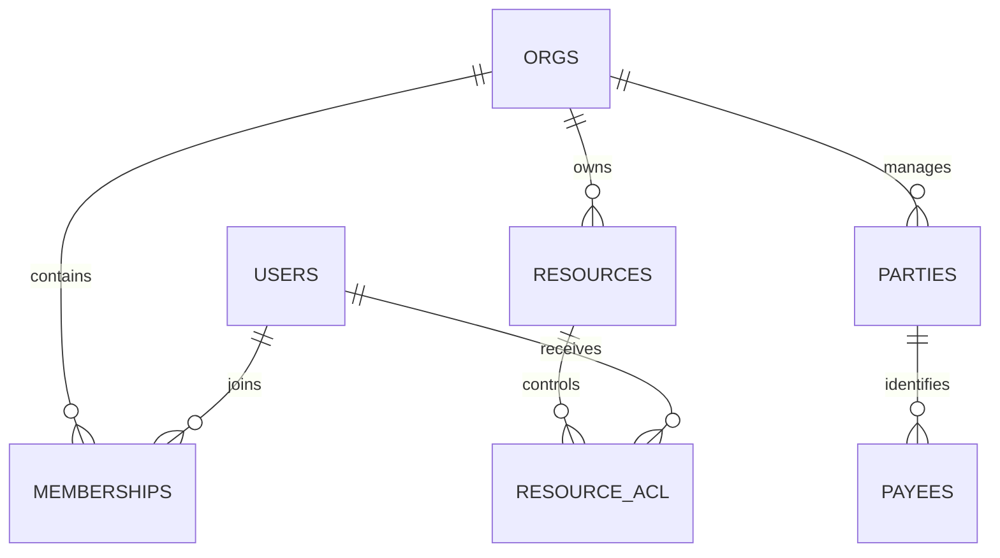
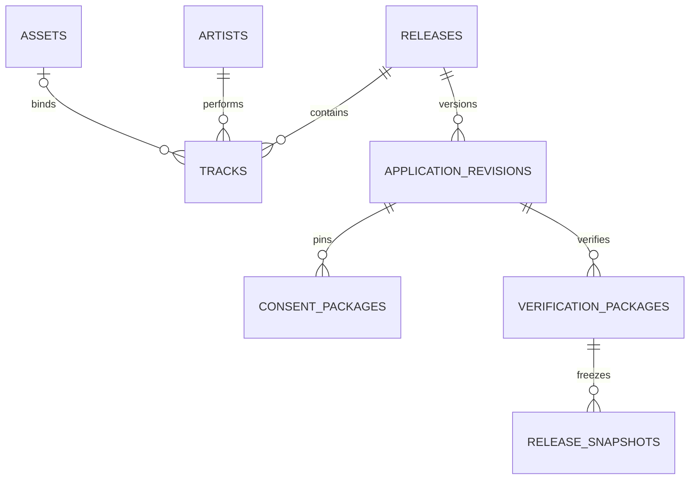

# F0 데이터 모델 및 의존 관계

기준은 [FINAL 1.0 보고서](BLUEPRINT.md) §2.1–2.5, §6.1, §10이다. 이 문서는 실제 Foundation DDL과 후속 개발 계약을 구분한다. 후속 기능은 타입이 있다는 이유만으로 실행 가능하지 않다.

## 실제 PostgreSQL 구조

마이그레이션 0001/0002: 6개 스키마, 업무/기반 테이블 26개(SQLx 이력 테이블 제외).

| 스키마 | 생성한 테이블 |
|---|---|
| identity | orgs, parties, users, memberships, sessions, auth_limits, resources, resource_acl, payees |
| catalog | labels, artists, releases, assets, upload_sessions, tracks, credits, application_revisions, consent_packages |
| distribution | verification_packages, release_snapshots |
| operations | audit_events, jobs, outbox, event_receipts, check_results, allowed_transitions |
| rights, finance | 스키마만 예약. 실행 테이블과 업무 API 없음 |

리소스 레지스트리의 조직/종류/ID와 카탈로그를 복합 FK로 연결한다. 레이블 Party, 아티스트 Label, 트랙 Release/Artist/Asset, 현재 revision 및 단계 자료 참조는 다른 조직으로 연결할 수 없다. 이름은 식별자가 아니다. User, Organization, Party, Artist, Label, Payee의 ID와 생명주기를 분리한다. 회원 가입은 개인 조직과 관리 Party를 만들지만 법적 신원 검증을 의미하지 않는다.

접근은 ACTIVE membership **및** 현재 유효한 resource_acl을 모두 요구한다. OWNER도 기존 리소스 ACL을 우회하지 않는다. 조직 목록과 카탈로그 목록은 같은 권한 계층을 사용한다. 플랫폼 권한은 음악 권리의 증거가 아니다.

## 불변성과 상태

- 수정 가능한 초안에는 row_version 비교를 사용한다. 동시 수정 하나만 성공한다.
- application_revisions, consent_packages, verification_packages, release_snapshots, check_results, audit_events, event_receipts는 UPDATE/DELETE 거부 트리거를 가진다.
- API 런타임 역할은 제출 revision/단계 패키지를 생성할 권한이 없다. 제출 API는 권한 검사 후 501이다.
- config/states.json은 네 축과 허용 전이의 Rust 타입 생성 기준이다. 0002의 DB 전이표와 대조하는 테스트로 불일치를 검출한다.
- F1에서는 상태 정의만 준비하고 파이프라인 진입 자체를 DB 트리거로 차단한다. 배급 준비, DSP 접수, DSP LIVE, 정산 확인을 합치지 않는다.
- 구 revision 검사 결과는 STALE이며 최신 revision이나 신청 상태를 바꾸지 않는다. 실제 QC가 없으므로 최신 검사도 자동 PASS하지 않는다.
- 초안 변경, 감사, Outbox와 후속 작업 등록은 한 트랜잭션이다. Outbox는 내부 event_receipts로만 소비한다. 이메일/D1/DSP를 전송하지 않는다.

## §2.1 전체 엔티티의 후속 구현 위치

| 보고서 엔티티 | Foundation 계약 및 후속 의존성 |
|---|---|
| mfa_factors, party_roles, delegations, account_trust_tiers | User/Party/Org 참조를 재사용한다. MFA, 법적 위임 검증, 신뢰 등급 부여는 미구현이다. |
| publication_revisions | 승인된 공개 필드만 불변 revision으로 만들어 D1에 게시해야 한다. 현재 게시 경로는 없다. |
| right_claims, contracts, contract_revisions, consents | Party와 신청 revision에 귀속한다. 계약 원문은 private asset 참조로 분리하고 계약 revision을 불변으로 핀해야 한다. |
| grant_atoms | Rust GrantAtom/EffectiveRange: 권리 주체·대상·지역·이용·기간·재허락·계약 revision. 구조 검증은 권리 승인과 다르다. |
| disputes, legal_representative_records | 권리 보류 및 미성년자 대리 동의 증거. 법률 요건 확정 전 제출을 열지 않는다. |
| commercial_split_plans, commercial_split_lines | Rust SplitPlan/SplitLine: 수취인, 계약 revision, 기간, 10000bp 분배 검증. DB 기간 중복 제약과 승인 흐름은 후속이다. |
| route_plans, dsp_endpoints | RouteContract는 contract_id, endpoint_id, fee_schedule_id를 필수로 받는다. 실제 계약·검증 endpoint 및 DSP별 적합성 없이는 활성화하지 않는다. |
| packages, delivery_jobs | DistributionPackage는 snapshot/route/operation/adapter/profile/hash/불변 bytes 참조를 핀한다. 패키지 영속 테이블, 생성기 및 외부 송출기는 후속이다. jobs는 일반 작업 큐이며 delivery_jobs와 다른 생명주기다. |
| external_ids, identifier_pool | 내부 UUID와 ISRC/UPC를 분리한다. 번호 발급·중복 번호 등록 기능은 없다. |
| live_bindings, migration_cases, match_candidates | DSP 실측 증거, 경로 이전, 카탈로그 중복 후보. 기존 Release/Track ID를 바꾸지 않고 연결할 후속 엔티티다. |
| royalty_reports, report_lines, royalty_match_candidates | 원본 보고서와 정규화 행, 카탈로그 매칭 후보를 분리한다. 배급 상태에서 수익 확인을 추론하지 않는다. |
| commercial_split_snapshots, ledger_transactions, ledger_entries | 정산 시 분배 조건을 고정하고 같은 통화 차대 균형을 검사한다. 현재 Rust 정수 최소단위 검증만 있으며, 실제 원장은 보고서의 NUMERIC/정밀도 정책을 적용해야 한다. |
| payout_orders, finance_holds | PayoutStatus는 별도 축이며 외부 결과 불명 상태의 자동 재지급은 금지한다. 실제 지급/승인/보류 영속 로직은 없다. |
| correction_requests, admin_overrides, domain_holds, review_tasks | ReturnTo와 FreshnessPin을 재사용한다. 사유·근거·승인자를 갖춘 후속 업무이며 관리자 API는 현재 닫혀 있다. |
| publication_outbox_receipts | 현재 event_receipts는 내부 이벤트 멱등성 전용이다. D1 게시 ACK는 별도의 revision/게시 결과 영수증으로 추가해야 한다. |

후속 테이블을 F1에 빈 껍데기로 생성하지 않는다. 도메인별 조직 키, 불변 revision 참조, 별도 상태 축과 명시적인 단계 경계를 유지하며 순차 마이그레이션으로 추가한다.

## 단계 전달과 작업 계약

config/contracts의 네 JSON Schema와 packages.rs는 §10의 ConsentPackageV1, ValidationPackageV1, VerificationPackageV1, PreparationPackageV1을 보존한다. UUID와 SHA-256 형식 및 해당 패키지 해시를 검증한다. 현재 canonical JSON은 정렬된 키 기반 내부 규격이며 JCS 준수를 주장하지 않는다.

FreshnessPin은 revision, verification hash, snapshot, rights epoch, 계약 및 package hash를 대조한다. 권리/계약 변경은 S2, 패키지/스냅샷 변경은 S3_PREP, revision 변경은 Pre-submit으로 환송하는 기준을 제공한다. 실제 송출 직전 원자적 재검사는 배급 실행기 개발 시 연결해야 한다.

jobs는 interactive/qc/rights/distribution/finance 큐, priority, run_at, attempts, max_attempts, lease token/만료를 갖는다. SKIP LOCKED 선점과 토큰·만료 조건으로 오래된 Worker 결과를 차단한다. 현재 안전한 outbox.record만 실행하며 미구현 작업은 성공하지 않는다. 외부 효과가 불명확한 송출/지급을 이 재시도 경로에 그대로 연결하면 안 된다.
